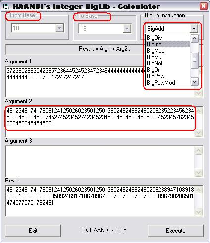



## Big numbers library \*BigNumLib\*

### Description

With this BigNumLib (big numbers library) you can do everything around large numbers (as strings):

standard operations: add, substract, divide, multiply, power, mod, powermod

boolean operations: and, or, not, xor, shl, shr, inc, dec

convert bases: from 2-64 to 2-64 (more than usual BigDecToHex or BigHexToDec)

And that all in a (for VB) short time!

Update: Now the code is up to 60% faster than before!!!
 
### More Info
 

             |
---                |---
**Submitted On**   |2005-10-03 13:02:08
**By**             |[HAANDI](https://github.com/Planet-Source-Code/PSCIndex/blob/master/ByAuthor/haandi.md)
**Level**          |Advanced
**User Rating**    |4.9 (68 globes from 14 users)
**Compatibility**  |VB 6\.0
**Category**       |[Math/ Dates](https://github.com/Planet-Source-Code/PSCIndex/blob/master/ByCategory/math-dates__1-37.md)
**World**          |[Visual Basic](https://github.com/Planet-Source-Code/PSCIndex/blob/master/ByWorld/visual-basic.md)
**Archive File**   |[Big\_number1937191032005\.zip](https://github.com/Planet-Source-Code/haandi-big-numbers-library-bignumlib__1-62738/archive/master.zip)

